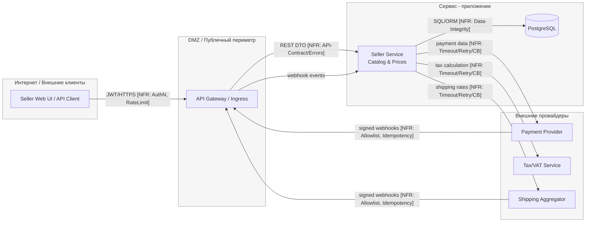

# TM - Требования безопасности + Модель угроз + ADR

> Этот файл - **индивидуальный**. Его проверяют по **rubric_TM.md** (5 критериев × {0/1/2} → 0-10).
> Подсказки помечены `TODO:` - удалите после заполнения.
> Все доказательства/скрины кладите в **EVIDENCE/** и ссылайтесь на конкретные файлы/якоря.

---

## 0) Мета

- **Проект (опционально BYO):** TODO: ссылка / «учебный шаблон»
- **Версия (commit/date):** TODO: abc123 / YYYY-MM-DD
- **Кратко (1-2 предложения):** TODO: что за система и кто ей пользуется

---

## 1) Архитектура и границы доверия

1.1 Роли и активы:

- **Акторы:** Продавец, Модератор, API Client, Платёжный провайдер (PSP), Налоговый провайдер (TAX), Агрегатор доставки (SHP).
- **Активы:** Каталог (SKU), цены и скидки, идентификаторы и секреты (JWT/refresh, API-токены, webhook-секреты), аудит, ПДн (PII).

1.2 Зоны доверия:

- **Internet:** UI клиент (U)
- **DMZ:** API Gateway/Ingress (A)
- **Internal:** Catalog & Prices (S), PostgreSQL (D)
- **External:** PSP, TAX, SHP

1.3. Context/DFD:

1.4 Критичные интерфейсы

**1. Интернет → API Gateway/Ingress (U → A)**  
**Данные:** JWT, PII, DTO.  
**Риски:** Broken AuthN/AuthZ, инъекции, утечки через ошибки, CORS‑misconfig, DoS.  
**Контроль:**
- TLS‑only + HSTS; запрет HTTP.
- JWT: фиксированный алгоритм, проверка `iss/aud/exp/nbf`, короткий TTL access‑токена; refresh по отдельному пути. *(NFR: Security-AuthN)*
- Rate limiting на токен/ключ/IP с корректными ответами **429 + Retry‑After**. *(NFR: RateLimiting)*
- CORS только по allowlist доверенных Origins. *(NFR: Security‑InputValidation)*
- Единый формат ошибок (`application/problem+json`), без стэктрейсов. *(NFR: API‑Contract/Errors; Observability)*
- Серверная валидация схемы/типа/размера тела. *(NFR: Security‑InputValidation; Data‑Integrity)*

**2. API Gateway/Ingress → Seller Service (A → S)**  
**Данные:** нормализованные DTO, заголовки трассировки (`X‑Correlation‑ID`).  
**Риски:** обход Gateway, неаутентифицированные вызовы, потеря трассировки.  
**Контроль:**
- NetworkPolicy/allowlist источников; повторная проверка JWT и tenant‑контекста в сервисе. *(NFR: Security‑AuthZ/RBAC)*
- Обязательный проброс и логирование `correlation_id`. *(NFR: Observability/Logging)*

**3. Seller Service ↔ PostgreSQL (S ↔ D)**  
**Данные:** PII, бизнес‑данные каталога/цен.  
**Риски:** SQL‑инъекции, утечка PII.  
**Контроль:**
- Параметризованные запросы / prepared statements; запрет конкатенаций. *(NFR: Data‑Integrity)*
- Row‑Level Security для tenant‑изоляции аредотатора; роли БД по наименьшим привилегиям. *(NFR: Security‑AuthZ/RBAC; Privacy/PII)*
- Шифрование в покое/бэкапах; маскирование PII в логах. *(NFR: Privacy/PII; Auditability)*

**4. Seller Service → Платёжный провайдер (S → PSP)**  
**Данные:** токены/ID платёжных сессий; карточные данные не обрабатываются сервисом.  
**Риски:** дубли списаний, зависания внешних вызовов, рассинхронизация статусов.  
**Контроль:**
- Hosted‑checkout/токенизация. *(NFR: Security; Privacy/PII)*
- Timeouts + ограниченные retries; **Circuit Breaker** на деградации. *(NFR: Timeouts/Retry/CircuitBreaker)*
- **Idempotency‑Key** на POST‑операциях; привязка к `orderId`, хранение ответов для повторов. *(NFR: Idempotency; Data‑Integrity)*

**5. Webhooks PSP → Ingress → Seller Service (PSP → A → S)**  
**Данные:** события об оплате (status change).  
**Риски:** подделка webhook, replay, повторная обработка.  
**Контроль:**
- Криптоподпись (напр., HMAC‑SHA256) + проверка timestamp/окна; IP‑allowlist. *(NFR: Security‑AuthN)*
- Идемпотентная обработка (дедупликация по event‑id/сигнатуре), быстрый 2xx ответ и асинхронная обработка. *(NFR: Idempotency; Availability)*

**6. Seller Service → Налоговый сервис (TAX)**  
**Данные:** агрегированные суммы/ставки, без избыточной PII.  
**Риски:** зависания, неверные расчёты, утечки через ответы.  
**Контроль:** минимизация полей, timeouts/retries, circuit breaker. *(NFR: Timeouts/Retry/CircuitBreaker; Privacy/PII)*

**7. Seller Service → Агрегатор доставки (SHP)**  
**Данные:** адреса/вес/габариты; PII.  
**Риски:** зависания, неверные расчёты, утечки через ответы. 
**Контроль:** минимизация PII; timeouts/retries; идемпотентные операции; маскирование PII в логах. *(NFR: Privacy/PII; Timeouts/Retry; Idempotency)*

1.5 Допущения

1. **Едиственная входная точка** извне — API Gateway/Ingress; прямых вызовов во внутренний сервис (S) нет.  
2. **Карточные данные не обрабатываются сервисом.** Оплата — через hosted page/session PSP; хранить только токены/идентификаторы и статусы (PCI DSS — SAQ A).  
3. **Внешние вызовы считаются «хрупкими» по умолчанию:** для TAX/PSP/SHP заданы timeouts <= *N* секунд, ограниченные retries с экспоненциальной паузой; при деградации включается circuit breaker.  
4. **Webhooks — источник истины по статусам** оплаты/доставки; каждый webhook подписан провайдером и **обрабатывается идемпотентно**; при наличии — применяется IP‑allowlist.  
5. **JWT:** асимметричная подпись (RS/ES), обязательные проверки `iss/aud/exp/nbf`, короткий TTL access‑токена; refresh‑токен хранится и передаётся отдельно.  
6. **CORS:** разрешены только доверенные Origins; `Access‑Control‑Allow‑Credentials: true` используется только с точным Origin, не `*`.  
7. **Ошибки API:** для лимитов — **429 + Retry‑After**, по возможности — заголовки RateLimit‑*.  
8. **Секреты:** не хранятся в коде.  
9. **База данных:** включает **RLS** для изоляции аредотатора; все обращения параметризованы/через ORM.  
10. **Наблюдаемость:** на всех CI‑ребрах передаётся и логируется `correlation_id`; аудит админ‑действий ведётся независимо от приложенческих логов.  
11. **Минимизация PII:** наружу (TAX/SHP/PSP) передаются только необходимые поля; PII в логах маскируется.  
12. **Квоты и ограничения:** публичные эндпойнты имеют пороги RPS/размеров тел; превышение ведёт к 413/429 по политике.

---

## 2) Реестр угроз STRIDE (TM2, TM3, S04)

| ID  | STRIDE | Компонент/поток              | Угроза                                                                                        | L | I | L×I |
|-----|--------|-------------------------------|----------------------------------------------------------------------------------------------------------------------|---|---|-----|
| T01 | **S**  | AUTH (U→A)                    | Подмена личности украденным/поддельным JWT (алгоритм/claims/TTL).                                                   | 3 | 5 | 15  |
| T02 | **T**  | U→A                           | Replay без timestamp: повтор того же запроса/оплаты.                                                                  | 3 | 4 | 12  |
| T03 | **R**  | Audit/Logging                 | «Отказ от действий»: нет надёжной связки user↔action↔correlation_id.                                                | 3 | 3 | 9   |
| T04 | **I**  | S→D (SQL)                     | Инъекции/грязный ввод -> чтение/порча данных.                                                                         | 2 | 5 | 10  |
| T05 | **D**  | S (публичные API)             | DoS/истощение ресурсов (нет лимитов/таймаутов/пула).                                                                 | 4 | 4 | 16  |
| T06 | **E**  | Repo/Secrets                   | Секреты/ключи в коде/логах -> эскалация доступа.                                                                      | 2 | 5 | 10  |
| T07 | **E**  | A→S, S→D (RBAC/Tenant)        | **Tenant breakout**: обход объектных/арендных проверок.                                                       | 4 | 5 | 20  |
| T08 | **S**  | PSP→A→S (webhooks)            | Подмена источника webhook (нет подписи/allowlist) / replay подписанного события.                                     | 3 | 4 | 12  |
| T09 | **T**  | U→A→S                          | Подмена бизнес-полей клиентом (цена/скидка/валюта) вместо серверного расчёта.                                        | 3 | 4 | 12  |
| T10 | **I**  | A↔S (ошибки/логи)             | Утечки PII/секретов в логах и ответах (стэктрейсы).                                                 | 3 | 4 | 12  |
| T11 | **D**  | S→PSP/TAX/SHP                 | Зависания без **timeouts/retry/CB** -> деградация сервиса.                                                            | 3 | 4 | 12  |
| T12 | **E**  | A→S (модель/DTO)              | **Mass Assignment** / подмена скрытых полей -> повышение прав/смена роли.                                             | 3 | 4 | 12  |
| T13 | **S**  | CORS (U→A)                    | Ошибки CORS/Origin-policy -> кража токена/неправильный доступ.                                                        | 2 | 4 | 8   |
| T14 | **T**  | S→PSP                          | Дублируемые платежи без **Idempotency-Key** (повторы/ретраи).                                                         | 3 | 4 | 12  |
| T15 | **I**  | Backups/Storage               | Утечка бэкапов/дампов (нешифр., общий доступ).                                                                       | 2 | 5 | 10  |
| T16 | **D**  | PSP/SHP webhooks              | Флуд вебхуков -> локальный DoS обработчиков.                                                                    | 3 | 3 | 9   |
| T17 | **E**  | D (PostgreSQL)                | Ошибки **RLS/ролей** БД -> чтение чужих строк/таблиц.                                                                 | 3 | 5 | 15  |
| T18 | **I**  | A→S                            | Избыточная экспозиция (raw объекты, предсказуемые ID) -> раскрытие данных.                                           | 3 | 3 | 9   |
| T19 | **S**  | A→S (east-west)               | Спуфинг сервиса (нет allowlist во внутреннем периметре).                                                        | 2 | 4 | 8   |
| T20 | **I**  | S (интеграции)                | **SSRF**/небезопасное потребление внешних API -> метаданные/ключи.                                                    | 2 | 5 | 10  |
| T21 | **D**  | U→A (каталог/корзина)         | **Denial of Inventory**: массовое «резервирование» товара в корзинах без покупки.                          | 3 | 4 | 12  |

---

## 3) Приоритизация и Top-5 _(TM3, S04)_

1. **T07 — Tenant breakout (RBAC/RLS)** — **L*I=20**  
   - **Экспозиция:** любой эндпойнт с ID/фильтром. 
   - **Чувствительность:** меж-tenant утечки PII/цен/заказов. 
   - **Частота:** массово встречается. 
   - **Обнаружимость:** низкая — выглядит как «валидные» запросы.  
   - **Решение:** объектные проверки на каждом доступе; `tenantId` обязателен и сверяется; **RLS** в БД на `SELECT/INSERT/UPDATE/DELETE`.

2. **T05 — DoS / Unrestricted Resource Consumption** — **L*I=16**  
   - **Экспозиция:** все публичные API. 
   - **Чувствительность:** простои/срыв SLA и рост затрат. 
   - **Частота:** массово встречается. 
   - **Обнаружимость:** средняя (метрики 5xx/латентность).  
   - **Решение:** **Rate-Limiting 429 + Retry-After/RateLimit-***, лимиты тела, пулы; **timeouts + ограниченные retries**, для внешних - **Circuit Breaker**.

3. **T01 — Подмена личности через JWT** — **L*I=15**  
   - **Экспозиция:** все write-операции. 
   - **Чувствительность:** полный доступ в рамках роли/тенанта. 
   - **Частота:** распространённые ошибки валидации/хранения. 
   - **Обнаружимость:** средняя.  
   - **Решение:** строгая проверка `iss/aud/exp/nbf`, короткий TTL, отдельный refresh-поток.

4. **T17 — Ошибки RLS/ролей БД** — **L*I=15**  
   - **Экспозиция:** весь слой данных. 
   - **Чувствительность:** меж-tenant чтение/модификация. 
   - **Частота:** частые конфигурационные ошибки. 
   - **Обнаружимость:** низкая.  
   - **Решение:** включить **RLS** по умолчанию (`ENABLE ROW LEVEL SECURITY`), явные политики `FOR SELECT/INSERT/UPDATE/DELETE`, тесты политик.

5. **T21 — Denial of Inventory (корзины/резервы)** — **L*I=12**  
   - **Экспозиция:** каталог/корзина. 
   - **Чувствительность:** прямые потери выручки/доступности товара. 
   - **Частота:** массово встречается - бот-трафик. 
   - **Обнаружимость:** средняя.  
   - **Решение:** лимиты на резервы по аккаунту/IP/фингерпринту, короткие TTL «холдов», поведенческие фильтры, отсечение headless-ботов.

---

## 4) Требования (S03) и ADR-решения (S05) под Top-5 (TM4)

### NFR-1. Аутентификация и защита токенов

- **AC (GWT):**
  - **Given** валидный токен, **When** запрос `/api/...`, **Then** `200` и `X-User-Id=subject`.
  - **Given** просроченный/поддельный токен, **When** запрос, **Then** `401` и событие `auth.token_invalid` в аудите.

### NFR-2. Лимиты и таймауты

- **AC (GWT):** rate-limit ≤ **N** rps/uid и ≤ **M** rps/ip; timeout ≤ **T** сек; при превышении - `429` + событие `rate_limit_hit`.

### NFR-3. Аудит критических операций

- **AC (GWT):** логируется `correlation_id`, uid, время и результат для операций (`login`, `role_change`, `data_export`, …).

> TODO: при необходимости добавьте свои NFR под Top-5.

---

### Краткие ADR (минимум 2) - архитектурные решения S05

(карточки короткие, по делу)

#### ADR-001 - TODO: название

- **Context (угрозы/NFR):** T01, NFR-1; контур AUTH
- **Decision:** что делаем и где (напр., проверка подписи токена в GW; короткий TTL; rotatable keys)
- **Trade-offs (кратко):** стоимость/производительность/UX
- **DoD (готовность):** измеримые условия (см. раздел 6)
- **Owner:** ФИО/роль
- **Evidence (план/факт):** EVIDENCE/dast-auth-YYYY-MM-DD.pdf#token-tests

#### ADR-002 - TODO: название

- **Context:** T05, NFR-2; публичные endpoint’ы
- **Decision:** rate-limit на GW + server-side timeouts; backpressure
- **Trade-offs:** возможные 429 и влияние на UX
- **DoD:** срабатывание 429 при >N rps; p95 ≤ T сек
- **Owner:** ФИО/роль
- **Evidence (план/факт):** EVIDENCE/load-after.png

---

## 5) Трассировка Threat → NFR → ADR → (План)Проверки (TM5)

| Threat | NFR   | ADR     | Чем проверяем (план/факт)                                                                 |
|-------:|-------|---------|-------------------------------------------------------------------------------------------|
| T01    | NFR-1 | ADR-001 | DAST auth-flow; аудит `auth.token_invalid` → EVIDENCE/dast-auth-YYYY-MM-DD.pdf / audit-sample.txt |
| T05    | NFR-2 | ADR-002 | Нагрузочный тест + проверка 429/таймаутов → EVIDENCE/load-after.png                       |
| T04    | NFR-X | ADR-00X | SAST/линтер на инъекции/параметризацию → EVIDENCE/sast-YYYY-MM-DD.pdf#sql-1              |
| T03    | NFR-3 | ADR-00Y | Анализ образцов аудита → EVIDENCE/audit-sample.txt#corrid                                |

> TODO: заполните таблицу для ваших Top-5; верификация может быть «планом», позже артефакты появятся в DV/DS.

---

## 6) План проверок (мост в DV/DS)

- **SAST/Secrets/SCA:** TODO: инструменты и куда положите отчёты в `EVIDENCE/`
- **SBOM:** TODO: генератор/формат
- **DAST (если применимо):** TODO: стенд/URL; профиль
- **Примечание:** на этапе TM допустимы черновые планы/ссылки; финальные отчёты появятся в **DV/DS**.

---

## 7) Самопроверка по рубрике TM (0/1/2)

- **TM1. Архитектура и границы доверия:** [ ] 0 [ ] 1 [ ] 2  
- **TM2. Покрытие STRIDE и уместность угроз:** [ ] 0 [ ] 1 [ ] 2  
- **TM3. Приоритизация и Top-5:** [ ] 0 [ ] 1 [ ] 2  
- **TM4. NFR + ADR под Top-5:** [ ] 0 [ ] 1 [ ] 2  
- **TM5. Трассировка → (план)проверок:** [ ] 0 [ ] 1 [ ] 2  

**Итог TM (сумма):** __/10
